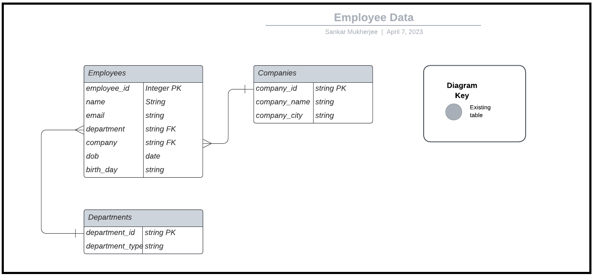

# Test Environment 

## Install Postgres

Use docker based Postgres instances for our DEMO.

```shell
docker run --name local-postgres -p 5432:5432 \
    -e POSTGRES_USER=postgres -e POSTGRES_PASSWORD=admin \
    -e POSTGRES_DB=employee -e POSTGRES_HOST_AUTH_METHOD=trust \
    -d postgres

```

## Database ERD




## Database Setup

[Script](./employee_setup_script.sql) can be used to set up the database according to the ERD.


> At this point you should have a Postgres RDBMS instance ready to proceed with the demo.
